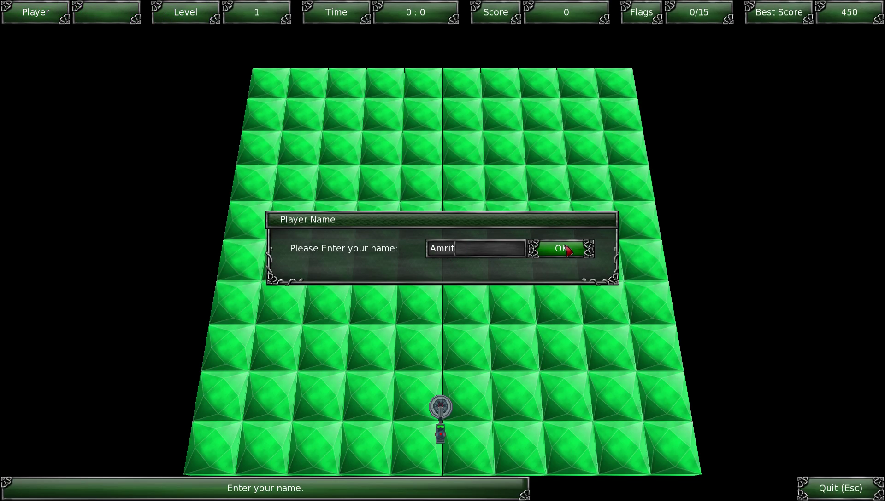

#
MineSweeper 3D

This is a 3D looking MineSweeper game created using Ogre engine, CEGUI, Bullet physics engine, and C++. I developed this game as a part of the final project for [Game Engine Development class](http://cs.gettysburg.edu/~cpresser/cs391/finalProject.html) that I took during the Spring Semester of 2015 at Gettysburg  College.  You can find more information about the game as well as instruction on how to build it here:

[MineSweeper 3D | Projects | Amrit Dhakal's Website](https://www.amritdhakal.com/project/MineSweeper-3D). 

Here are some screenshots from the game:

